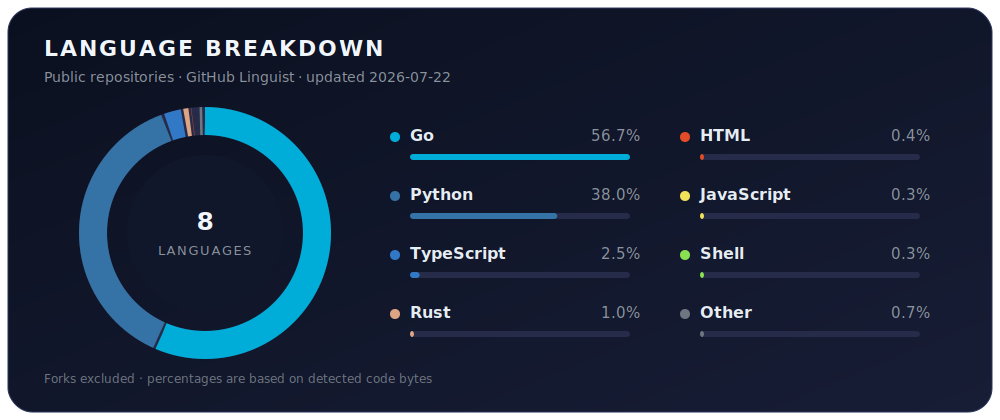

# StatPan / Ilgu Kim

Building GitHub-native agent workflows, MCP tool layers, and data infrastructure for testable AI-assisted delivery.

### Current Focus

- [Gira](https://github.com/StatPan/gira): GitHub-native control plane for issue -> branch -> PR -> checks -> completion evidence
- MCP/tooling: typed tool interfaces, versioned specs, fixtures, and agent-ready execution paths
- Datapan: private data platform workbench for Korean public/domain data, research corpora, and agent-ready data workflows
- AI-assisted delivery: tests, lint, CI, review loops, and operational guardrails around agent work

### Data Infrastructure

Datapan is my private data platform workbench. The public signal is the range and structure of the collection axes, not only raw volume.

- Public and administrative data workflows
- Legal, assembly, policy, and regulated-domain data
- Real estate, geospatial, routing, weather, and app-supporting feature marts
- Market, macro, finance, and investment research data
- Research-paper metadata and literature corpora, including arXiv, OpenAlex, and HuggingFace Papers style pipelines
- Raw ingestion, canonical schemas, marts, coverage checks, and data lineage for agent-ready downstream use

### External Open Source

Selected work in upstream projects outside my own repositories:

- ✅ [OpenHands Software Agent SDK #3252](https://github.com/OpenHands/software-agent-sdk/pull/3252): custom `FileStore` injection path *(merged)*
- ✅ [OpenHands Software Agent SDK #2936](https://github.com/OpenHands/software-agent-sdk/pull/2936): warn when falling back to in-memory storage *(merged)*
- 🟢 [Hermes Agent #15864](https://github.com/NousResearch/hermes-agent/pull/15864): Discord message edit and delete admin actions *(open)*
- 💬 [OpenHands #14028](https://github.com/OpenHands/OpenHands/issues/14028): Gemini full-endpoint URL handling *(issue)*
- 💬 [LiteLLM #26979](https://github.com/BerriAI/litellm/issues/26979): Gemini `api_base` duplicate-path handling *(issue)*
- 💬 [OpenCode #21311](https://github.com/anomalyco/opencode/issues/21311): SDK prompt-part input ID validation *(issue)*

### Personal Open Source

Projects I maintain and build in public:

- [Gira](https://github.com/StatPan/gira) + [Homebrew tap](https://github.com/StatPan/homebrew-tap): GitHub-native control plane for issue-to-PR AI software workflows
- [Agentree](https://github.com/StatPan/agentree): Figma-like infinite canvas for visualizing and controlling AI agent trees
- [Hermes State Vault](https://github.com/StatPan/hermes-state-vault): open-source agent state synchronization and restore layer
- Datapan public-data toolchain: [CLI](https://github.com/StatPan/datapan-cli), [Registry](https://github.com/StatPan/datapan-registry), and [Health](https://github.com/StatPan/datapan-health)
- Public-data clients: [Assembly API Client](https://github.com/StatPan/assembly-api-client), [DART API Client](https://github.com/StatPan/dart-api-client), and [Korean Data Portal Client](https://github.com/StatPan/kr-data-portal-client)

### Writing

- [statpan.com](https://statpan.com) for technical notes, project notes, and longer-form engineering context

### Language Stats

